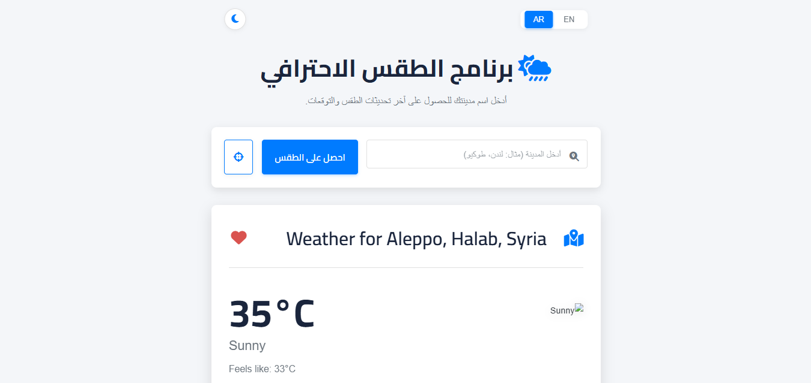
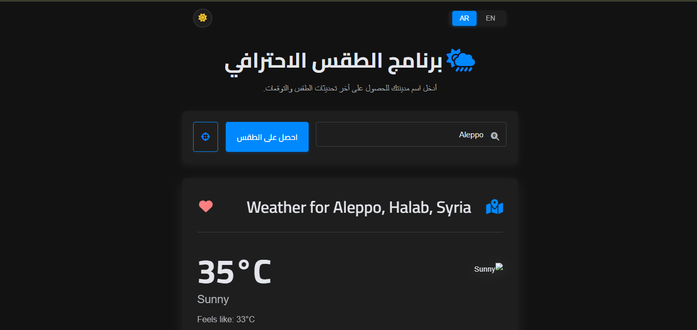
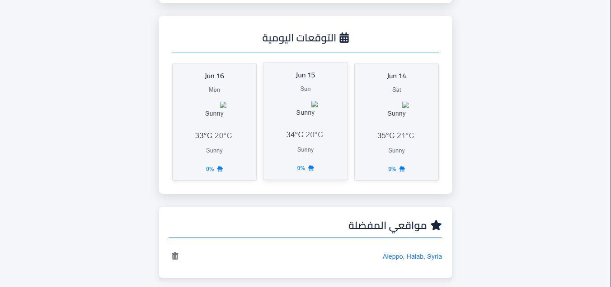

# WeatherSense Pro 🌦️

**WeatherSense Pro** is a feature-rich, full-stack weather application designed to provide users with real-time weather information, multi-day forecasts, and a personalized experience. Built with Node.js, Express.js, and Vanilla JavaScript, this application showcases a range of modern web development techniques and API integrations.

## ✨ Features

*   **Current Weather Data:** Get up-to-date weather conditions for any searched city, including temperature, humidity, wind speed, pressure, visibility, and UV index.
*   **Multi-Day Forecasts:** View weather predictions for the upcoming days (e.g., 3-day forecast) with maximum/minimum temperatures and weather conditions.
*   **Geolocation:** Automatically fetch weather information for the user's current location with a single click.
*   **Favorite Locations:** Users can save and manage a list of their favorite locations for quick weather lookups (data stored in `localStorage`).
*   **Dark/Light Mode:** A sleek, user-toggleable dark mode for comfortable viewing in different lighting conditions.
*   **Multilingual Support (i18n):** Fully localized interface supporting English and Arabic.
*   **Responsive Design:** Optimized for a seamless experience across desktops, tablets, and mobile devices.
*   **User-Friendly Interface:** Clean, intuitive, and easy-to-navigate UI.

---

## 🛠️ Technologies Used

**Backend:**
*   **Node.js:** JavaScript runtime environment.
*   **Express.js:** Fast, unopinionated, minimalist web framework for Node.js.
*   **Axios:** Promise-based HTTP client for making API requests.
*   **dotenv:** For managing environment variables.
*   **i18n (i18n-node):** For internationalization and localization.
*   **Helmet:** For securing Express apps by setting various HTTP headers.
*   **Express Rate Limit:** For basic rate-limiting to protect against abuse.

**Frontend:**
*   **HTML5:** Standard markup language for creating web pages.
*   **CSS3:** For styling the application, including custom properties (variables) for theming.
*   **Vanilla JavaScript (ES6+):** For all client-side logic, DOM manipulation, and API interactions.
*   **Handlebars.js:** Templating engine to generate HTML dynamically.
*   **Font Awesome:** For icons.

**APIs:**
*   **WeatherAPI.com:** For fetching current weather and forecast data.
*   **OpenCage Geocoding API:** For converting city names to geographic coordinates (geocoding) and coordinates to location names (reverse geocoding - *if implemented*).

**Development Tools & Practices:**
*   **Git & GitHub:** For version control and collaboration.
*   **npm:** Node package manager.
*   **nodemon (optional for development):** For automatically restarting the server during development.

---

## 🚀 Getting Started

Follow these instructions to get a copy of the project up and running on your local machine for development and testing purposes.

### Prerequisites

*   Node.js (v16.x or later recommended)
*   npm (usually comes with Node.js)
*   Git (for cloning the repository)

### Installation

1.  **Clone the repository:**
    ```bash
    git clone https://github.com/your-username/weathersense-pro.git
    cd weathersense-pro
    ```
    *(Replace `https://github.com/your-username/weathersense-pro.git` with your actual repository URL)*

2.  **Install NPM packages:**
    ```bash
    npm install
    ```

3.  **Set up Environment Variables:**
    Create a `.env` file in the root directory of the project and add your API keys:
    ```env
    WEATHERAPI_KEY=your_weatherapi_com_api_key
    OPENCAGE_API_KEY=your_opencagedata_com_api_key
    PORT=3000 # Optional, defaults to 3000
    ```
    *   You can get a free API key from [WeatherAPI.com](https://www.weatherapi.com/).
    *   You can get a free API key from [OpenCage Geocoding](https://opencagedata.com/).

4.  **Run the application:**
    ```bash
    npm start
    ```
    *(This assumes you have a `start` script in your `package.json` like `"start": "node src/app.js"`)*
    
    Or for development with nodemon (if configured):
    ```bash
    npm run dev 
    ```
    *(This assumes a script like `"dev": "nodemon src/app.js"`)*

    The application should now be running on `http://localhost:3000` (or the port you specified).

---

## 📂 Project Structure (Simplified)
Use code with caution.
Markdown
weathersense-pro/
├── public/ # Static assets
│ ├── css/
│ │ └── style.css
│ └── js/
│ └── script.js
├── src/ # Server-side code
│ ├── tools/ # Utility modules (geocode, forecast)
│ │ ├── geocode.js
│ │ └── forecast.js
│ └── app.js # Main Express application file
├── views/ # Handlebars templates
│ ├── index.hbs
│ └── 404.hbs
├── locales/ # i18n translation files
│ ├── en.json
│ └── ar.json
├── .env # Environment variables (ignored by Git)
├── .gitignore
├── package.json
├── package-lock.json
└── README.md
---

## 🖼️ Screenshots

*(Optional: Add a few more screenshots showcasing different features like dark mode, favorites list, forecast view, etc.)*

**Light Mode:**


**Dark Mode:**


**Favorites List:**



---

## 🌟 Future Enhancements (Potential Next Steps)

*   **Improved UI/UX:**
    *   Toast notifications for user actions (e.g., adding favorites).
    *   Advanced animations and transitions.
    *   Skeleton loaders for a better loading experience.
*   **More Weather Details:**
    *   Hourly forecasts.
    *   Air Quality Index (AQI).
    *   Sunrise/Sunset times.
*   **User Accounts:**
    *   Allow users to register and save preferences/favorites to a database.
*   **Progressive Web App (PWA) features:**
    *   Offline support and installability.
*   **Unit & Integration Testing.**
*   **Deployment to a cloud platform.**

---

## 🤝 Contributing

Contributions, issues, and feature requests are welcome! Feel free to check the [issues page]([https://github.com/your-username/weathersense-pro/issues](https://github.com/77hamed77/WeatherApp)) (if you plan to use it).

1.  Fork the Project
2.  Create your Feature Branch (`git checkout -b feature/AmazingFeature`)
3.  Commit your Changes (`git commit -m 'Add some AmazingFeature'`)
4.  Push to the Branch (`git push origin feature/AmazingFeature`)
5.  Open a Pull Request

---

## 📝 License

This project is licensed under the MIT License - see the `LICENSE.md` file for details (optional, but good practice to add a LICENSE file).

---

## 🙏 Acknowledgements

*   [WeatherAPI.com](https://www.weatherapi.com/) for providing the weather data.
*   [OpenCage Geocoding](https://opencagedata.com/) for geolocation services.
*   [Font Awesome](https://fontawesome.com/) for icons.
*   All the developers of the open-source libraries used in this project.

---

**Connect with me:**
*   YouTube: [[Your YouTube Channel URL\]](https://youtu.be/SfHNHHBNeJc) 
Use code with caution.

كيفية استخدام هذا القالب:
إنشاء ملف README.md: إذا لم يكن لديك واحد بالفعل، أنشئ ملفًا بهذا الاسم في جذر مشروعك.
نسخ ولصق المحتوى: انسخ المحتوى أعلاه في ملف README.md الخاص بك.
التخصيص:
اسم المشروع: يمكنك تعديل WeatherSense Pro إذا كان لديك اسم مختلف.
لقطة الشاشة الرئيسية: استبدل placeholder-for-your-app-screenshot.png برابط أو مسار لقطة شاشة جذابة لواجهة تطبيقك الرئيسية. إذا كان لديك رابط مباشر للتطبيق، ضعه مكان https://your-app-live-url.com.
رابط المستودع: استبدل https://github.com/your-username/weathersense-pro.git برابط مستودعك الفعلي على GitHub.
API Keys: ذكّر المستخدمين بالحصول على مفاتيح API الخاصة بهم.
أوامر التشغيل: تأكد من أن أوامر npm start أو npm run dev تتطابق مع ما هو موجود في ملف package.json الخاص بك.
هيكل المشروع: قم بتعديل قسم "Project Structure" إذا كان هيكل مشروعك مختلفًا قليلاً.
لقطات شاشة إضافية: إذا أضفت المزيد من لقطات الشاشة، قم بتحديث المسارات.
روابط المساهمة: إذا كان مشروعك مفتوح المصدر وترحب بالمساهمات، قم بتحديث الروابط.
الترخيص (License): إذا كان لديك ملف LICENSE.md، تأكد من الإشارة إليه. (إنشاء ملف MIT License بسيط جدًا).
معلومات الاتصال: أضف روابط ملفاتك الشخصية.
الصور:
إذا كانت الصور محلية في مستودعك، تأكد من أن المسارات صحيحة (مثلاً، قم بإنشاء مجلد docs/images/ وضع الصور فيه، ثم استخدم مسارات مثل docs/images/light-mode.png).
أو يمكنك رفع الصور إلى خدمة استضافة صور والحصول على روابط مباشرة.
المراجعة: اقرأ الملف جيدًا للتأكد من خلوه من الأخطاء الإملائية أو النحوية وأن جميع الروابط تعمل.